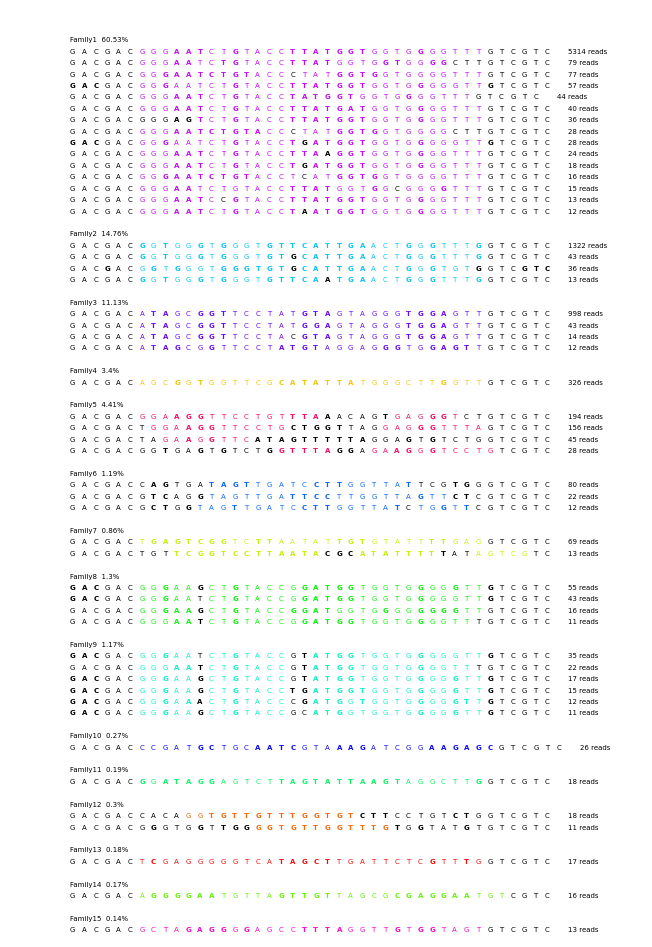

# aptamerutils
A simple Python package for short nucleic acid sequences (for example, aptamers) arrangement, sorting, clustering. 

This package can be installed from PyPI:
```
pip install aptamerutils
```
For more about classes and functions of this package, see notebook files in `.docs/`

